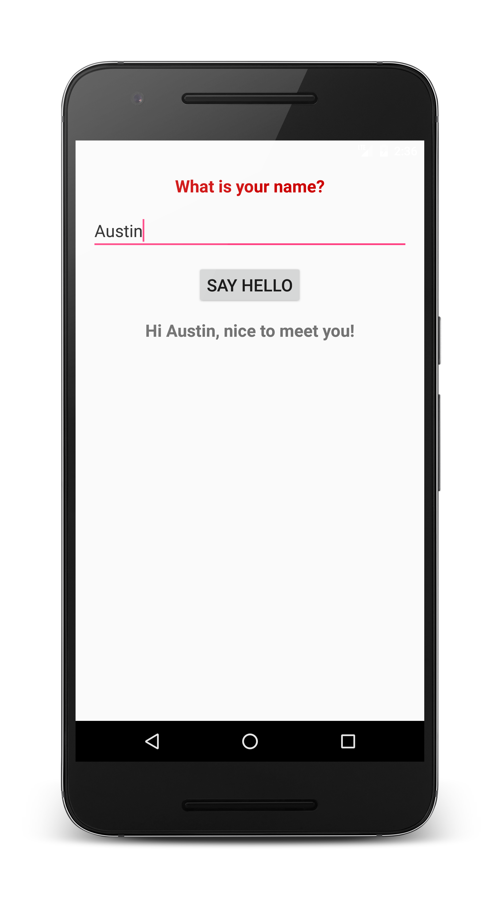

`HelloWorld.java` and `HelloWorldActivity.java` share many common aspects. Other than the obvious of them sharing the same `.java` file extension, each class starts with the same basic class declaration (`public class <Class Name>`). In addition, there is always a method that runs when the program is started, whether it is `public static void main(String[])` (or, as in `HelloWorld.java`, `main()`), or `protected void onCreate(Bundle)`. They also use other methods from other classes, such as `println()`, `super.onCreate(Bundle)`, and `setContentView(Id)`. There is also always some form of Javadoc comment. Finally, most lines end with either a curly bracket or a semicolon.

